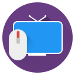
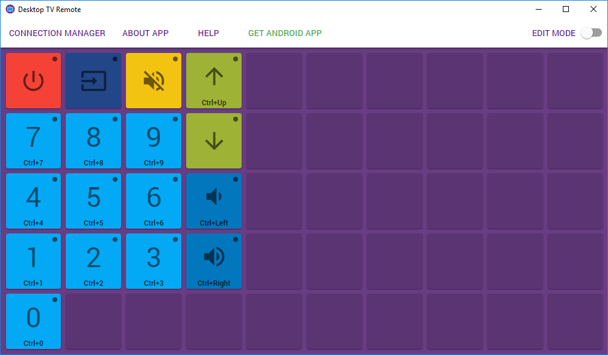
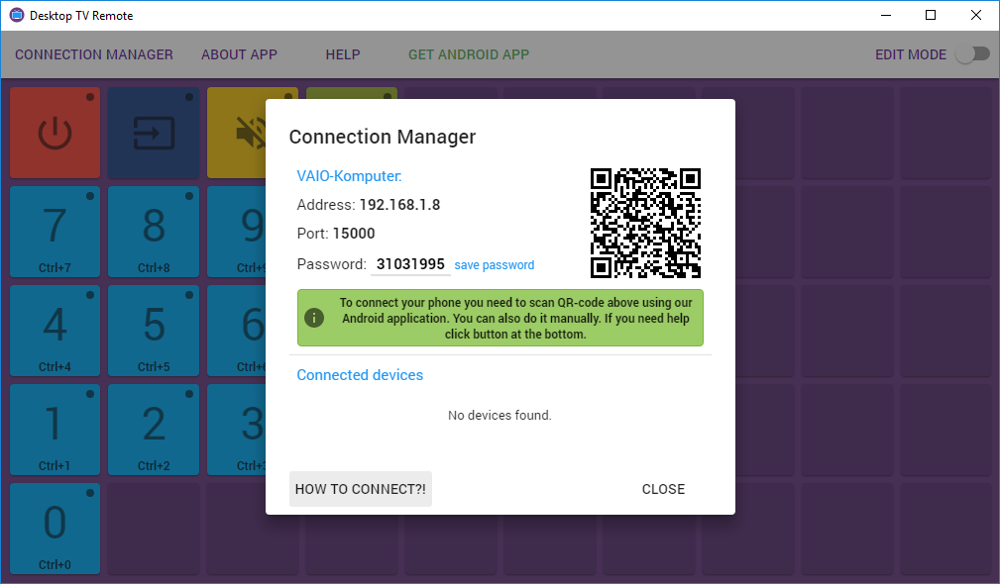
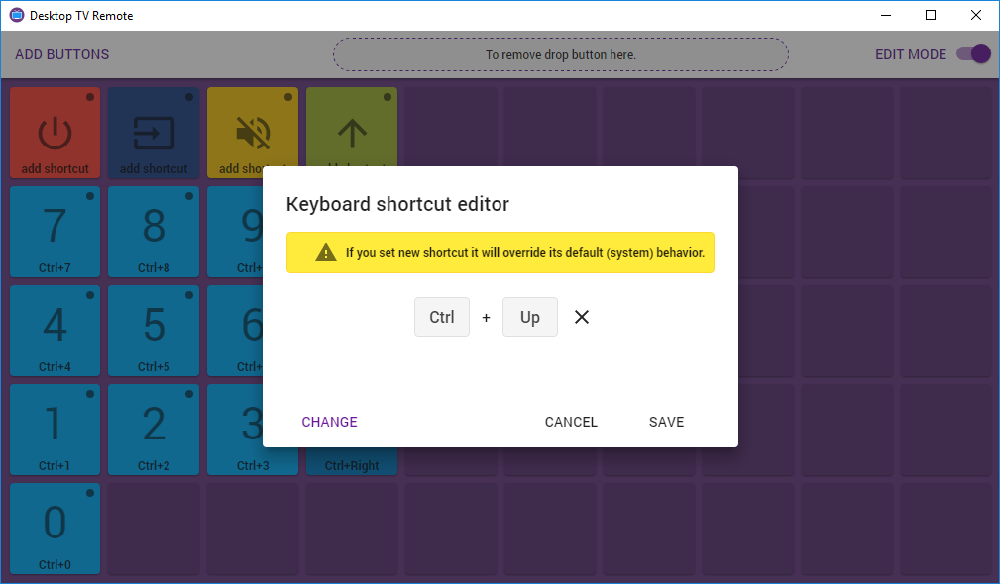
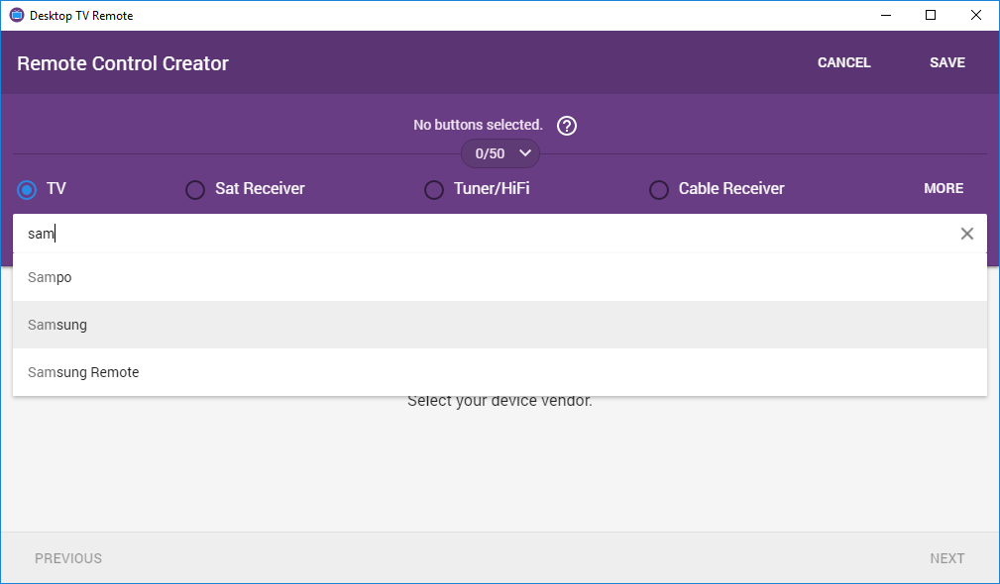
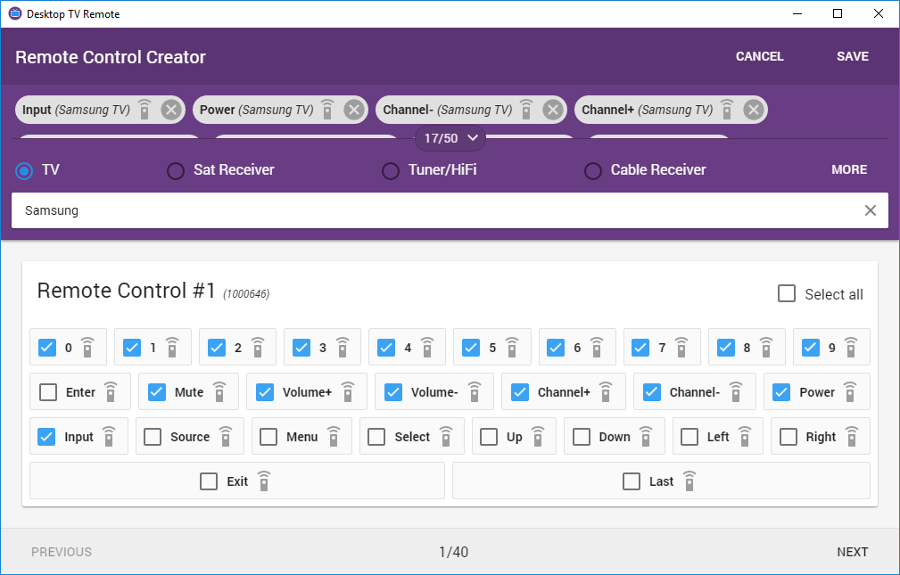

<h1>Desktop TV Remote</h1>

<h3>Basic idea of this project is to control TV and other IR devices by computer using keyboard shortcuts or graphical interface.</h3>

<iframe src="https://www.facebook.com/plugins/like.php?href=https%3A%2F%2Ffacebook.com%2FDesktopTVRemote%2F&width=450&layout=standard&action=like&size=large&show_faces=true&share=true&height=80&appId" width="450" height="80" style="border:none;overflow:hidden" scrolling="no" frameborder="0" allowTransparency="true"></iframe>

## DESKTOP APPLICATION INSTALLER IS NOT READY YET. STAY TUNED PLEASE.
<!-- 
 WINDOWS LINK | ANDROID LINK TODO 
 -->

> 
<l>Desktop application main screen.</l>

> 
<l> [Android application](https://github.com/tomaszczart/DesktopTVRemote/) main screen. </l>

> 
<l>It is easy to connect phone to app, just scan QR-code.</l>

> 
<l>The shortcut is global, so it will work even if the app does not have the keyboard focus.</l>

> 
<l>There is over 1000 vendors in database.</l>

> 
<l>You can customize your remote by selecting buttons.</l>

# Contributors

Tomasz Czart ([czart.tomasz@gmail.com](mailto:czart.tomasz@gmail.com))

# Dev

Built with [Electron](http://electron.atom.io).

