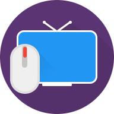
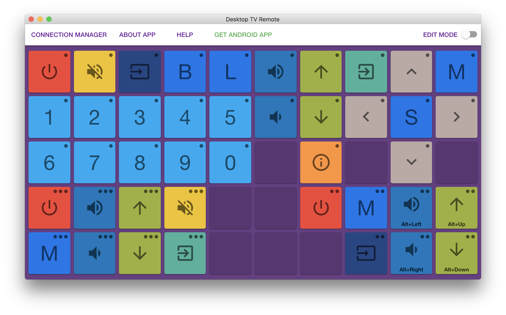
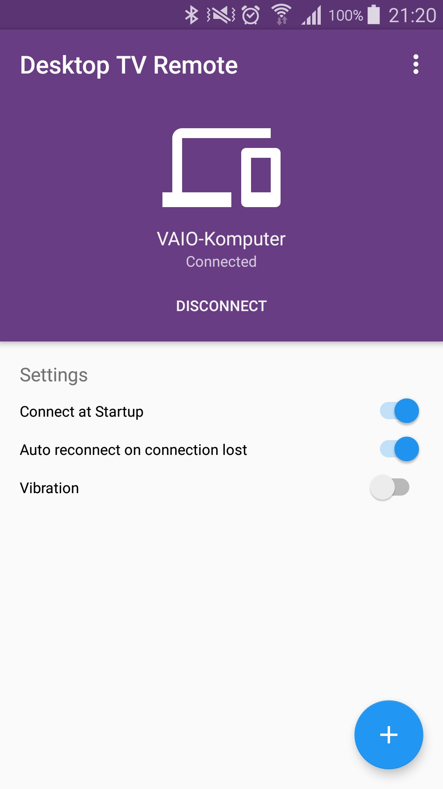
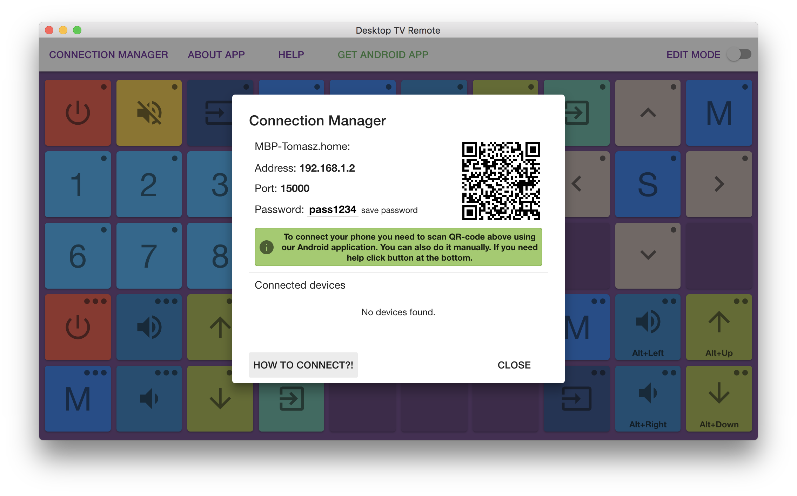
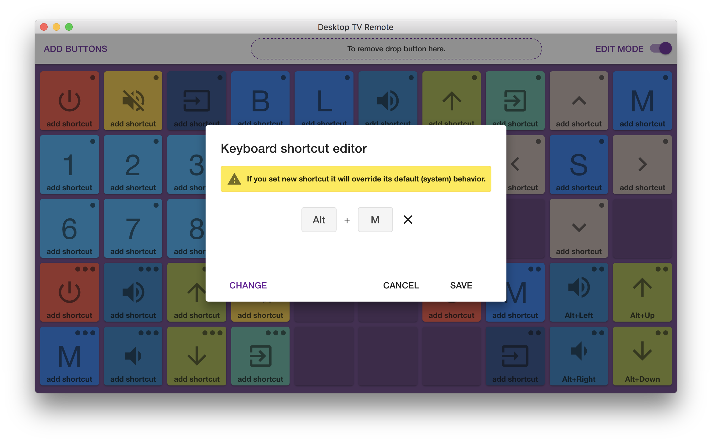
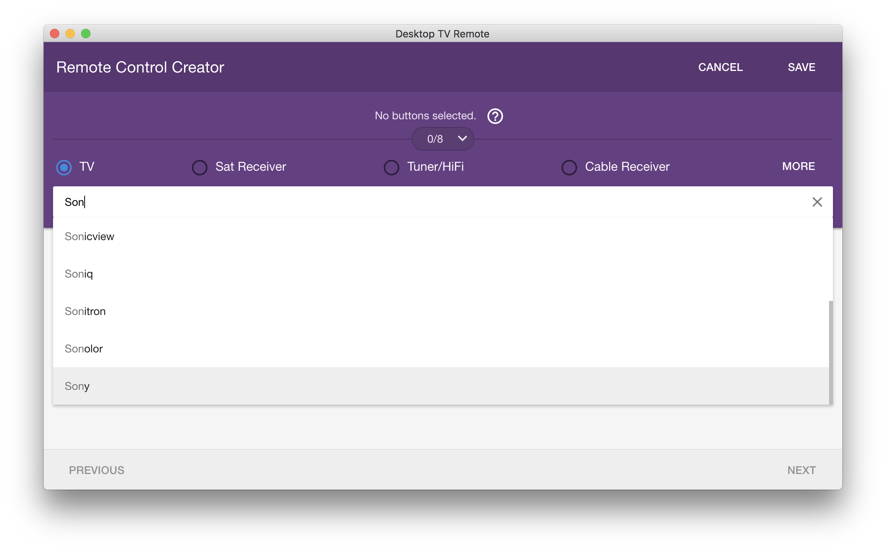
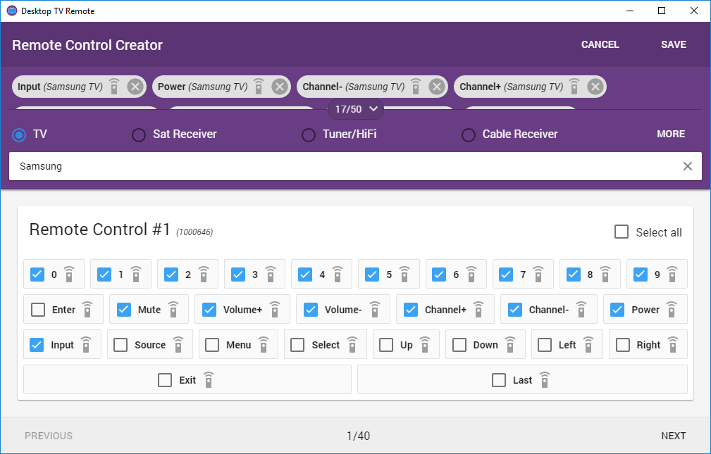

# Desktop TV Remote

### Basic idea of this project is to control TV and other IR devices by computer using keyboard shortcuts or graphical interface.

#### Dowload desktop app and Android client app [here](http://tomaszczart.github.io/DesktopTVRemote).

*Desktop application main screen.*

*Android application main screen.*

*It is easy to connect phone to app, just scan QR-code.*

*The shortcut is global, so it will work even if the app does not have the keyboard focus.*

*There is over 1000 vendors in database.*

*You can customize your remote by selecting buttons.*

# Contributors

Tomasz Czart ([czart.tomasz@gmail.com](mailto:czart.tomasz@gmail.com))

# Dev

Built with [Electron](http://electron.atom.io).

